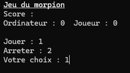
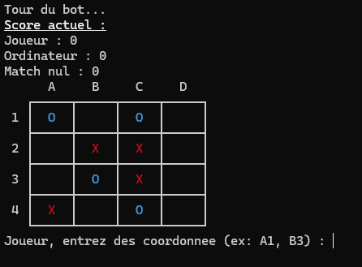
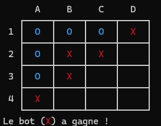
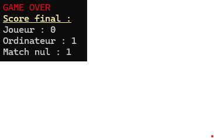

# 🎮 Morpion en C


Un jeu de morpion (tic-tac-toe) réalisé en langage C avec un affichage console propre (Unicode + couleurs).

## 📦 Comment compiler le projet

- Utiliser la commande `make`
- Executer le fichier avec la commande `./morpion`

> [!NOTE]
> Sous windows il possible que la commande `make` ne fonctionne pas, dans ce cas il faut se servir de `mingw32-make`

> [!NOTE]
> Il est possible de supprimer les fichier construit avec la commande `make clean`

## 🌳 Arboressence du fichier

```
/morpion
 ├── headers/
 │    ├── grille.h
 │    ├── joueur.h
 │    └── bot.h
 ├── src/
 │    ├── grille.c
 │    ├── joueur.c
 │    └── bot.c
 ├── main.c
 ├── Makefile
 └── README.md
```

## 🧩 Modules

### grille.c

Ce fichier contient toutes les fonctions liées à la gestion de la grille :

* `void setGrilleVide(int grille[TAILLE][TAILLE]);` :
  Réinitialise la grille en vidant toutes les cases.

* `void afficheGrille(int grille[TAILLE][TAILLE]);` :
  Affiche la grille en utilisant des caractères Unicode (┌, ┐, └, ┘, ┬, ┴, ┼, ├, ┤, ─).

* `void afficheCaseCouleur(int camp);` :
  Affiche une croix rouge, un cercle bleu ou un espace vide selon le camp.

* `bool estCaseVide(int grille[TAILLE][TAILLE], int ligne, int colone);` :
  Renvoie `true` si la case est vide.

* `void effaceConsole();` :
  Efface l'affichage de la console.

* `bool estCoupValide(int grille[TAILLE][TAILLE], int ligne, int colone);` :
  Vérifie qu'un coup est jouable (dans les limites de la grille et sur une case vide).

* `void convertitCoordonnees(char coordLetttre[2], int coordConvertie[2]);` :
  Convertit des coordonnées classiques (ex : A1) en indices du tableau. Renvoie 99 si la lettre n'est pas comprise entre 'A' et 'D'.

* `bool estDansGrille(int grille[TAILLE][TAILLE], int ligne, int colone);` :
  Vérifie si les coordonnées existent dans la grille.

* `bool estGrilleRemplie(int grille[TAILLE][TAILLE]);` :
  Vérifie s'il reste des cases vides.

* `int estPartieFinie(int grille[TAILLE][TAILLE]);` :
  Cherche une victoire et renvoie :

  * 0 : partie non terminée
  * 1 : victoire de la croix
  * 2 : victoire du cercle
  * 3 : égalité


### joueur.c

- `void jouerCoup(int grille[TAILLE][TAILLE], int ligne, int colone, int camps);`:
Joue le camp (croix/cercle) mis en parametre dans les coordonées indiquer 

### bot.c

- `void jouerBot(int grille[TAILLE][TAILLE]);`:
Recherche le coup le plus préférable à jouer en fonction de critère prédéfinis et à l'aide des autres fonctions présente dans le module

- `bool trouverCoupGagnant(int grille[TAILLE][TAILLE]);`:
Place une croix dans chaque case vide pour voir si en jouant un seul coup il est possible de gagner, si c'est le cas, pose une croix dans la première case remplisant ce critère

- `bool trouverCoupBloquant(int grille[TAILLE][TAILLE]);`:
Place un cercle dans chaque case vide pour voir si en jouant un coup il est possible pour le joueur de gagner, si c'est le cas, place une croix dans la première occurence trouver

- `bool prendreCentre(int grille[TAILLE][TAILLE], int *ligne, int *col);`:
Regarde les cases au centre de disponible et en prend une

- `bool prendreCoin(int grille[TAILLE][TAILLE], int *ligne, int *col);`:
Regarde les cases sur les coins de disponible et en prend une

- `bool prendreBord(int grille[TAILLE][TAILLE], int *ligne, int *col);`:
Regarde les dernière cases libre et en prend une

## 🚀 Piste d'amelioration

Bien que rudimentaire, l'algorithme du bot c'est montrer très efficace contre la majorité des joueur. Cependant il est possible de l'améliorer. En effet pour l'heure le bot se contente de vérifier s'il peut imédiatement gagner, si ce n'est pas le cas il vérifie s'il peut empecher le joueur de gagner. Ensuite il se contente de prendre une case selon l'ordre de priorité (Centre>Coins>Bord)

Pour un bot plus difficile, il serait possible d'ajouter :

* un algorithme **MinMax** pour prévoir plusieurs coups à l'avance ;
* une **table de vérité** pour connaître les coups optimaux ;
* une gestion plus avancée des ouvertures et stratégies.

## 🖼️ Illustration

Voici quelque photo du programme en cours d'éxcution:





